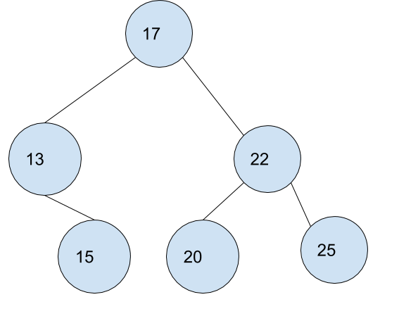

# Binary Search Tree
A BST is a binary tree where children greater than their parents go to the left, and children greater than their parents go to the right.

## Depiction

A binary Search tree is comprised of nodes with values and pointers to their children and to their parents. Sometimes if data is inserted in a specific order, it may degrade into a linked list. This can be averted by using specifically avl or red-black trees, which rotate to keep the nodes balanced. 

## Operations

### Insertion: O(Log n)
Insertion is log n because it should only search at most, about half the tree to find where it should lie.

### Search: O(log n)
Again, it divides and conquers to only search half, then half of that half, continuining to go down until it finds the searched for node.

### Deletion: O(log n)
It takes log n time because the node, if it is lower, takes more time to search, and less to make sure the children are in order, and vice versa. 

## Use Cases
Binary search trees are very good at being searched, only having O(log n) time to be searched.

A bad use case for a binary tree is to have data that you want to add and remove a lot, as that slows it down.

## Example
exBST = BST()

exBST.append(3)

exBST.append(5)

exBST.append(1)

if exBST.search(1):

	exBST.delete(1)
