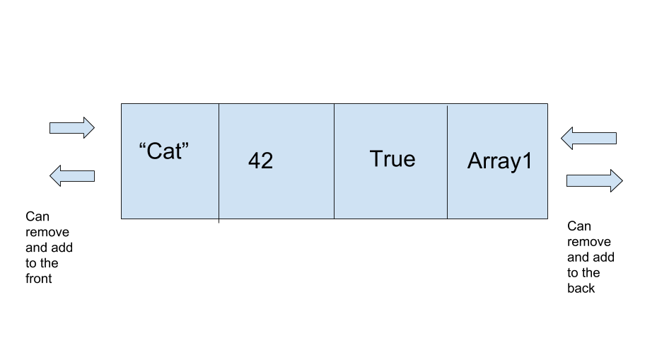

# Deque
A deque is a double ended queue, where it is possible to both add and remove from the front or back.

## Depiction in Memory

A deque is a double ended queue, as to say that you can add in remove in both the front and back. In essence, it is a combination of the stack and queue.

## Operations

### Pop/Push Front: O(1)
Like a stack, these are both O(1) because there is a pointer to the front.

### Pop/Push Back: O(1)
Like a queue, these are also O(1) because of the pointer to the back of the deque.

## Use Cases
A deque is good when both the first and last elements need to be added/deleted. An example could be a line, where people at the front are served, but people in the back might want to leave the line, but can't if there is someone blocking their way to the back.

A deque is terrible when data needs to be sorted, or if data in the middle needs to be inserted or deleted.

## Example
exdeque = deque()

for i in range(3):

	exdeque.backpush(i)

exdeque.frontpush(0)

firstinline = exdeque.frontpop()

lastinline = exdeque.backpop()

