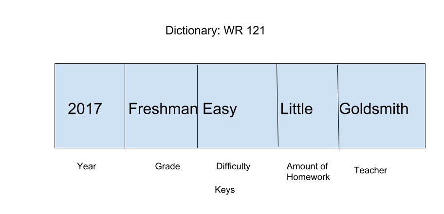

# Dictionary
A dictionary is a data structure that stores keys that go through a hash function to access data within.

## Depiction

Each key goes through a hash function to give it a specific address. Hash functions are to be made so as to be random, so not to overwrite keys, but still identifiable so that a key can still get the data within.

## Operations

### Search/Insert/Delete: O(1)
All of these operations are O(1) because it has to run through the hash function with the key, and then it will have the data, almost like acessing data inside an array with a couple of extra steps.

## Use Cases

A Dictionary is good for its O(1) capabilities including search, insert, and delete

A dictionary can be bad for ordering, and if the hash function is bad, keys will eventually be overwritten.

## Example
exdict = {
"brand": "Asus",
"cpu": "i5",
"year": 2009}

exdict.pop("year")

exdict["colour"] = "black"
