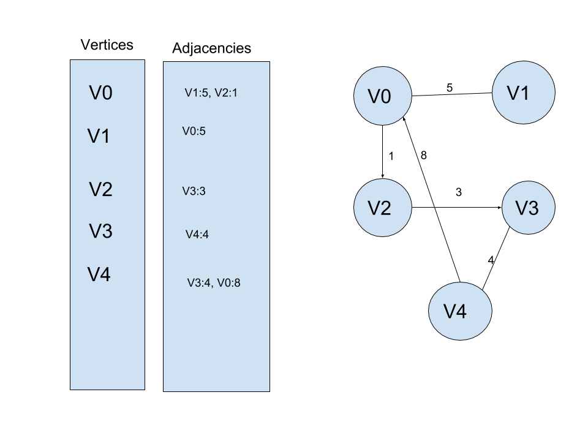

# Graph
A Graph is a collection of nodes and vertices that map data and its connection to other data.

## Depiction in Memory

Depicted on the lft is a how a graph using an adjacency list would look in memory. On the right is a depiction that is easier for humans to parse, but means the same thing. There is data, shown as verticies, or nodes and edges, which connect nodes, which can also have data, known as weights. These weights make it easier or harder to visit certain nodes. While the adjacency list is good to show graphs with little edges, matrix lists allow for an easier depiction of edges, with the verticies acting as both an x and y axis to depict edges.

## Operations

### Add Vertex: 0(1)
Adding a vertex, even if it does add more edges is an O(1) operation because you can append it and the edges with it to an adjacency list.

### Add Edge: O(1)
For the same reasons as a vertex, adding an edge is also O(1).

## Use Cases
A graph is good when you have data that has connections, and maybe has resistance within those connections.

A graph is bad at displaying information that is not connected as well as a graph that would look like a straight line could be better displayed as a linked list or an array.

## Example 
exgraph = Graph()

exgraph.addnode(node1)

exgraph.addnode(node2)

exgraph.addedge(node1, node2, 7)
