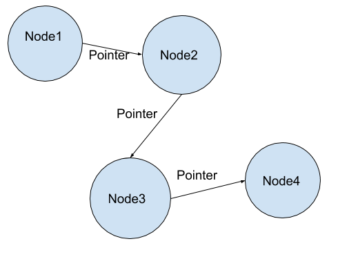

# Linked List
A linked list is a number of nodes with values, connected by pointers to the next.

## Depiction

As shown, each node has a value and a pointer to the next node. The list itself only has a pointer to the starting, meaning that one had have to traverse from one node to the next. In some lists, there are also pointers backwards, making it doubly linked, and sometime the tail links to the head, making it a circular linked list.

## Operations

### Search: O(n)
The search for a linked list is O(n) because it might have to go over each seperate node to find the one it is looking for.

### Insertion/Deletion: O(1)
Insertion and deletion are O(1) because the only thing to be changed is the pointers of the previous and next node, meaning that one does not need to search the entire list.

## Use Cases
Linked lists are best used when there is a lot of insertion and deletion.

Linked lists are lacking when searching happens extremely often

## Example
exlist = LinkedList()

exlist.insert(node1)

node1.insert(node2)

node1.delete()
