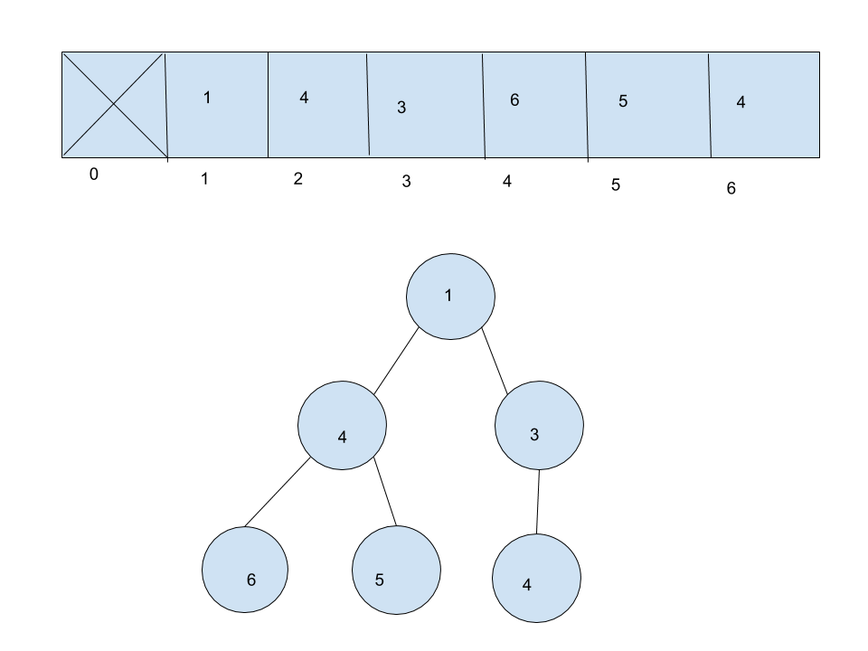

# Binary Heap
A binary heap is a Binary Tree that is either min/max and has either the smallest/largest value at the root.

## Depiction

The top is what is depicted in memory, usually using an array, with the first one bieng empty. The parent of any node in the array will be its index // 2. On the bottom is a visual depiction of what happens, with the root, and its children, which fill up from left to right, level to level.

## Operations

### Insert: O(log n)

Insertion is Log n because firstly, it takes the value and puts it at the end of the array. Then it checks the parent and switches if the child is bigger. It repeats this for as long as it needs to. Since it might check all the way up the tree, thus dividing and conquering the problem, the solution is log n.

### Delete: O(log n)

Delete is where it takes the root, returns it and then deletes it, replacing it with last node in the array. Then it does the opposite of inserting and compares with the child, and if the child is bigger, then they switch, repeating until the root is the smallest and all children are smaller than their parents.

## Use Cases

The most common use case for a binary heap is for a priority queue, where the things that have a lower or higher value get completed first, while others have to wait.

A binary heap is not good for keeping things in order, which it does not do. It is also not good for taking anything out except for the root.

## Example

exheap = MinHeap()

exheap.insert(node1)

exheap.insert(node2)

print(exheap.delete)
