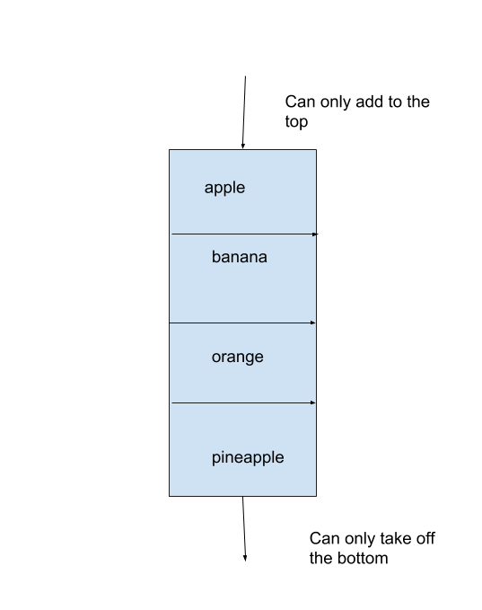

# Queue
A queue is a first in, first out data structure, where you can only add to the top, and take from the bottom.

As shown, it is a fifo structure, most commonly created with a linked list or an array, both with pointers to the end, as well as the beginning.

## Operations

### Enqueue: O(1)
Just like adding to a stack, it is only O(1) complexity.

### Dequeue: O(1)
This also is statiac because of the pointer to the end, which will move up after deleting the bottom most element. It also returns the element removed.

## Use Cases
A queue is good for situations like a line, where the first one in line is the first one to get served.
It is bad for practically everything else, for example, things that need sorting or items with priorities.

## Example
exq = Queue()

exq.enqueue(15)

print(exq.dequeue)

