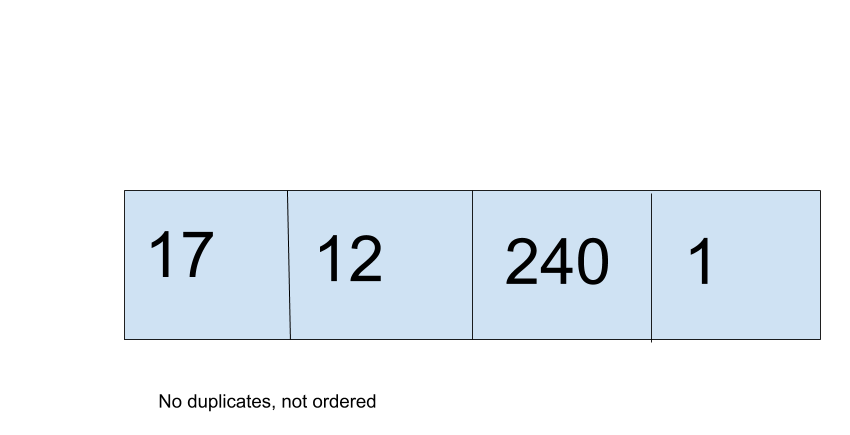

# Set
A set is an unordered collection of data that has no duplicates.

## Set Depiction

As shown, the values are unnordered, and random when the whole set is displayed and there can be no duplicates. In addition, the values cannot be edited once entered, but they can be deleted.

## Operations

### Add/Delete: O(1)
Since it is unordered, it uses a hash table to allow it to have O(1) addition and deletion. 

## Use Cases
A good example for a use of a set is usernames. There can only be one of each, they can't be changed, and they do not need to be in any particular order, but many more need to be added.

Sets should not be used when things need to be ordered or changed.

## Example

exset = {"green", "yellow", "blue"}

exset.remove("yellow")

exset.add("green")

