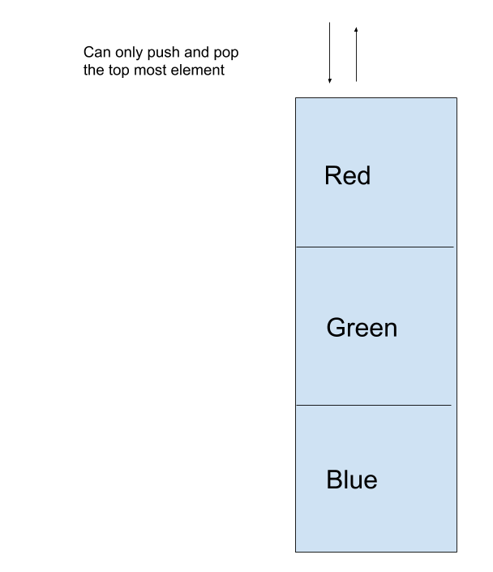

# Stack
A Stack is a last in, first out data structure, where only the top-most data is accessible.

## Depiction

As shown above a stack is a lifo data structure. It is most commonly built with an array or a linked list. Also shown is the ability to only manage the topmost part of the stack, with the only way to access the ones below is to remove the top.

## Operations

### Push: O(1)
Push is O(1) because it simply changes the top of the stack pointer to the most recently added, thus, not having to traverse the structure at all.

### Pop: O(1)
Pop is also O(1) because it simply returns the top, deletes it, and sets the pointer to the next element in the stack.

## Use Cases
A stack is great when a lifo structure is necessary, like when stacking plates.

A stack is terrible when things past the top need to be edited, such as sorting or inserting.

## Example
exstack = Stack()

exstack.push(data1)

print(exstack.pop)
