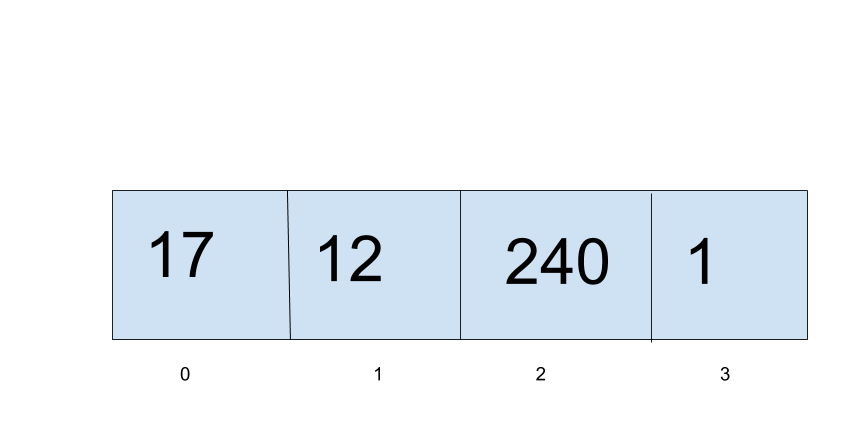

# Tuple
A tuple is an ordered, immutable data structure.

## Tuple Depiction

A tuple is essentailly an immutable array.

## Operations

### Read: O(1)
Like an array, it has O(1) random access because of the same size of the elements, but there is no add, edit, or delete because it is immutable.

## Use Cases
Tuples are good to have a solid, unchangeable thing that will never morph.

It is bad when you need the data structure to change.

## Example
extuple = (0, 1, 2, 3, 4, 5)
print(extuple[4]
